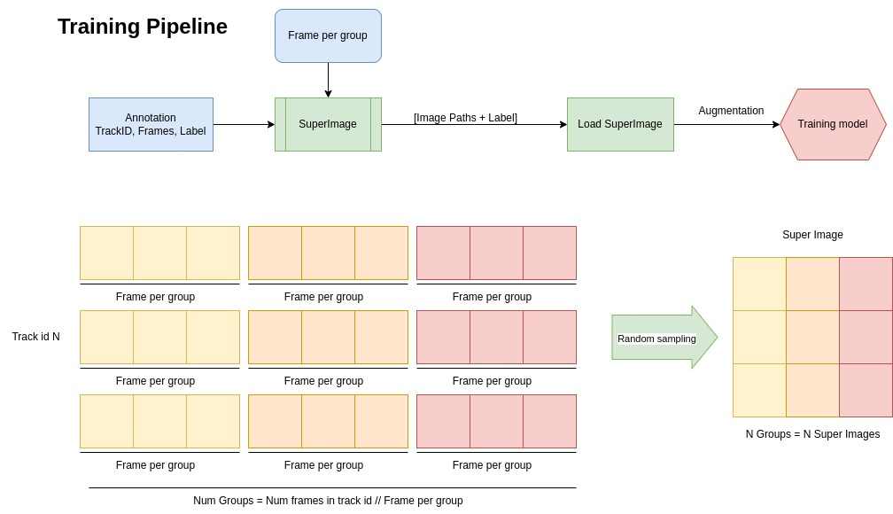
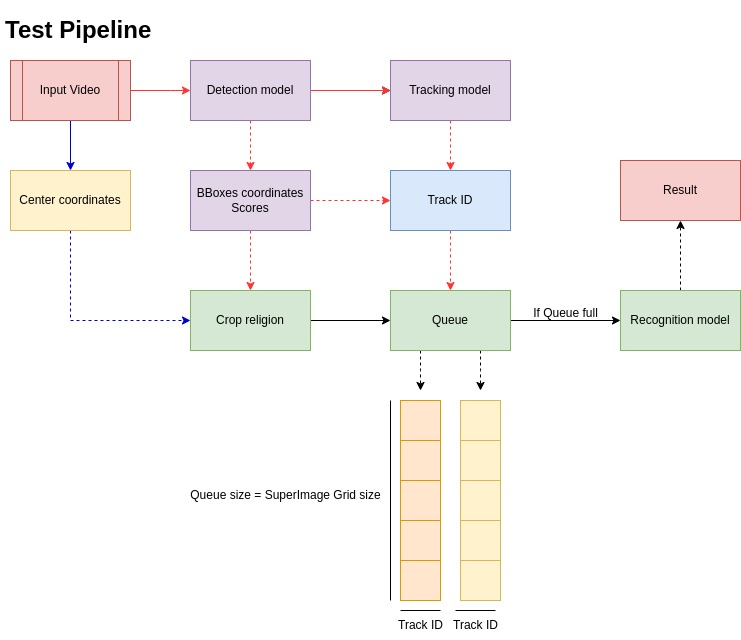

# Online-Action-Detection
Welcome to our GitHub Pages dedicated to online action detection, where we explore innovative techniques to enhance real-time action recognition.

Our approach leverages stack images and 2D CNNs to efficiently extract temporal information as in [SIFAR paper](https://arxiv.org/pdf/2106.14104.pdf), providing an alternative to the resource-intensive 3D convolution methods commonly used in this domain.

The core of our work centers around a light-weight model developed based on the mmpretrain framework, enabling efficient and accurate action detection with reduced computational complexity. Dive into our repository to discover more about our research, codebase, and contributions to advancing the field of online action detection.

## System overview
Draw.io [link](https://drive.google.com/file/d/1Bwfq9d31ETHNoinpQw3PynawHrT-1wNT/view?usp=sharing) 

## Installation
- Refer to [docs/installation.md](docs/installation.md) for installing necessary libs.

### New Data 
- Refer to [docs/data.md](docs/data.md) for to know how to label and create new dataset.

## Usage
- Refer to [docs/train_test.md](docs/train_test.md) for to know how train and test the model.

## Deployment
- Refer to [docs/deployment.md](docs/deployment.md) for to know how convert model to ONNX.

## Inference 
- Refer to [docs/inference.md](docs/inference.md) for inference the model on video.
